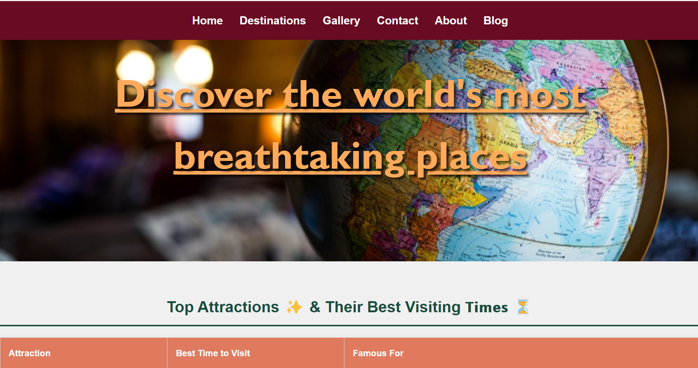
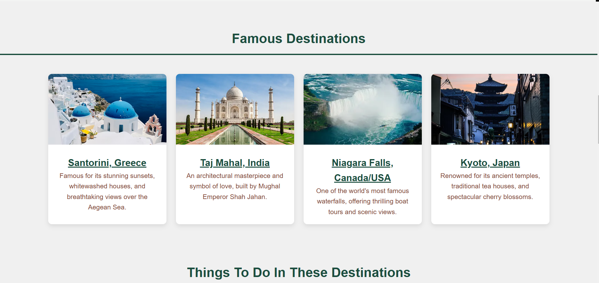
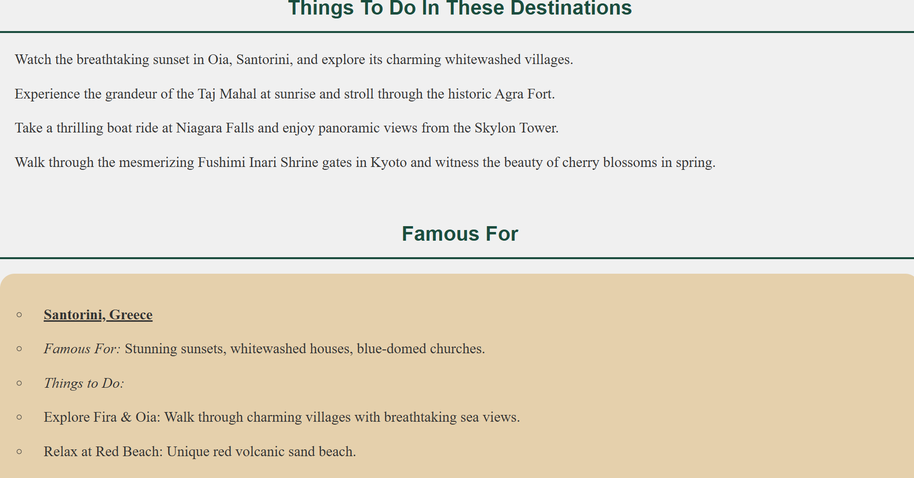
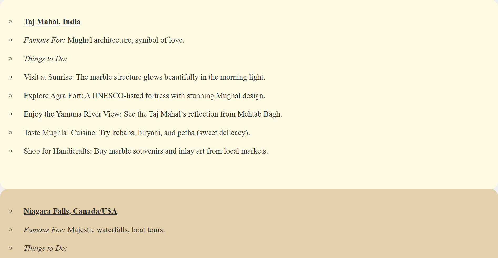
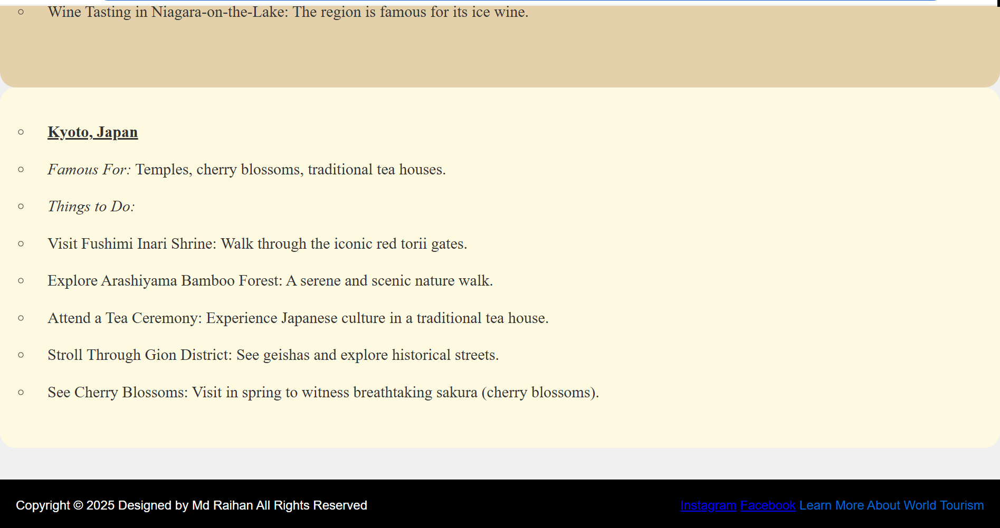

# Mdraihanahmad.github.io-Travel_Destination
# 🌍 Travel Destinations Website   

Welcome to the **Travel Destinations** website! This project showcases some of the most breathtaking tourist locations around the world, along with useful travel tips and the best times to visit each attraction.   

## ✨ Features   
- 🌟 **Beautiful Travel Guide** – Showcases top attractions like Santorini, the Taj Mahal, Niagara Falls, and Kyoto.   
- 📅 **Best Visiting Times** – Plan your trips effectively with recommended travel periods.   
- 📸 **Stunning Destination Cards** – Visually appealing UI displaying key travel destinations.   
- 📖 **Travel Tips & Things to Do** – Handy recommendations for travelers.  

## 📂 Project Structure   
🛠️ Tech Stack 
HTML – Structure of the webpage. 
CSS – Styling, layout, and responsive design. 
📷 Screenshot 
 
 
 
 
 
 
 
📝 Author 
👤 Md Raihan Ahmad 
📍 Designed with ❤️ by Md Raihan 